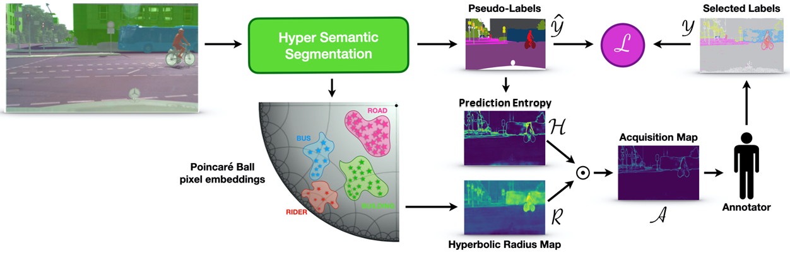

# Hyperbolic Active Learning

This is the official PyTorch implementation of the **ICML 2024** paper [**Hyperbolic Active Learning for Semantic Segmentation under Domain Shift**](https://arxiv.org/abs/2306.11180).

*Luca Franco <sup>&dagger; 1</sup>, Paolo Mandica <sup>&dagger; 2</sup>, Konstantinos Kallidromitis <sup>3</sup>, Devin Guillory<sup>4</sup>, Yu-Teng Li<sup>4</sup>, Trevor Darrell<sup>4</sup>, Fabio Galasso<sup>1,2</sup>*  
*<sup>1</sup> ItalAI,<sup>2</sup> Sapienza University of Rome, <sup>3</sup> Panasonic North America, <sup>4</sup> UC Berkeley*  
<sup>&dagger;</sup> Equal contribution

---

<p align="center">

</p>

## Usage

You can choose to run the code in a conda environment or in a docker container. Follow the instructions below to set up your preferred environment.

### Conda env setup

```bash
conda create --name halo -y python=3.9
conda activate halo
pip install -r requirements.txt
```

### Docker env setup

Modify the `docker-compose.yml` file to set the correct number of available GPUs. Then set your correct path for the `DATA_VOLUME` and run the following commands:

```bash
export UID=$(id -u)
export GID=$(id -g)
export DATA_VOLUME="YOUR_PATH_TO_DATA_FOLDER"

docker compose build
docker compose up -d
```

### Data Preparation

1. Download the [Cityscapes Dataset](https://www.cityscapes-dataset.com/), [GTAV Dataset](https://download.visinf.tu-darmstadt.de/data/from_games/), [SYNTHIA Dataset](https://synthia-dataset.net/), [ACDC Dataset](https://acdc.vision.ee.ethz.ch/) and extract them.

2. If you downloaded the datasets in a different folder, symlink them to the `datasets` directory:

    ```bash
    ln -s /path_to_cityscapes_dataset datasets/cityscapes
    ln -s /path_to_gtav_dataset datasets/gtav
    ln -s /path_to_synthia_dataset datasets/synthia
    ln -s /path_to_acdc_dataset datasets/acdc
    ```

3. Generate the label static files for GTAV/SYNTHIA Datasets by running

    ```bash
    python datasets/generate_gtav_label_info.py -d datasets/gtav -o datasets/gtav/
    python datasets/generate_synthia_label_info.py -d datasets/synthia -o datasets/synthia/
    ```

The `datasets` directory tree should be structured as follows:

```
├── datasets/
│   ├── cityscapes/     
|   |   ├── gtFine/
|   |   ├── leftImg8bit/
│   ├── gtav/
|   |   ├── images/
|   |   ├── labels/
|   |   ├── gtav_label_info.p
│   └──	synthia
|   |   ├── RAND_CITYSCAPES/
|   |   ├── synthia_label_info.p
│   └──	acdc
|   |   ├── images/
|   |   ├── gt/
```


### Training

The config files for the different training protocols can be found in the `configs` directory.

Before running the training/testing scripts, make sure to set the correct paths in the config files.

```bash
python train.py -cfg CONFIG_PATH
```

### Testing

```bash
python test.py -cfg CONFIG_PATH
```

### Training with ACDC Dataset or SegFormer architecture

To train with the ACDC dataset or the SegFormer architecture, you need to switch to the corresponding branch:

```bash
git checkout acdc
```
or
```bash
git checkout segformer
```

The two branches will be merged into the main branch soon.

## Acknowledgements

This project is based on the [RIPU](https://github.com/BIT-DA/RIPU) open-source project, with our re-implementation in PyTorch Lightning for multi-gpu active learning. We thank the authors for making the source code publically available.

## Licence

This project is licensed under the terms of the MIT license.

## Citation

If you find this repository useful, please consider giving a star :star: and citation:

```latex
@misc{franco2024hyperbolic,
      title={Hyperbolic Active Learning for Semantic Segmentation under Domain Shift}, 
      author={Luca Franco and Paolo Mandica and Konstantinos Kallidromitis and Devin Guillory and Yu-Teng Li and Trevor Darrell and Fabio Galasso},
      year={2024},
      eprint={2306.11180},
      archivePrefix={arXiv},
      primaryClass={cs.CV}
}
```